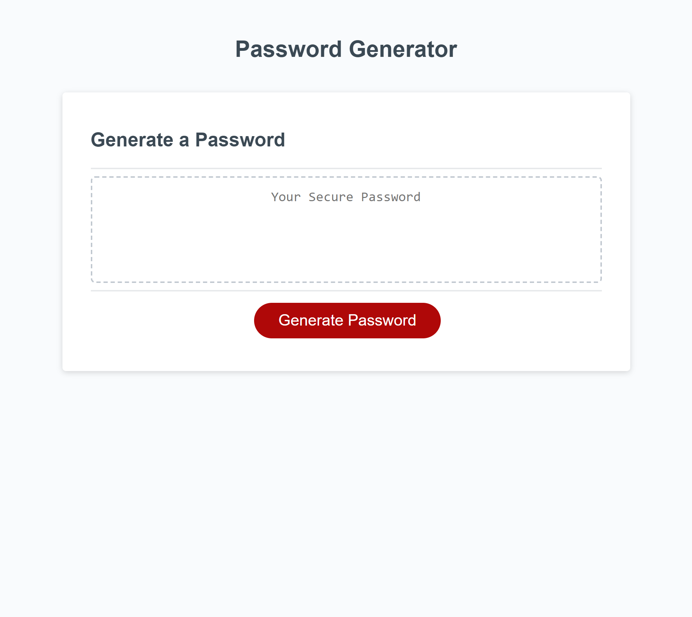

# Password-Generator
This is the completed project for bootcamp Challenge 03.

Find the finished product <a href="https://psiko23.github.io/Password-Generator/">here</a>.

## Overveiw

This application is designed to create randomized secure passwords according to parameters set by the user. The website appears as follows:

## Review
This project helped me to understand javascript logic on a better level, but I defintely need more practice. 
